# Free5e Contribution Guide
<!-- spell-checker:words TTRPGs Wyrmworks -->

> **Note:**
> This contribution guide is very much _work in progress_.

## How you can help

There are a number of ways that you can contribute to Free5e:

- Read it, play it, and spread the word.
  Free5e is intended to be used.
  It should _especially_ enable people to play who either may otherwise not have easy access to the rules for this kind of game, or who don't feel represented by other, similar games out there.
  If you like TTRPGs, then this is meant for you, whoever you are.
- Download and review the game on [DriveThruRPG](https://www.drivethrurpg.com/en/product/513248/free5e-core-rulebook-bundle-bundle).
- Report issues, if you find any.
  You can do so by [creating an issue here on GitHub](https://github.com/wyrmworkspublishing/free5e/issues) (you require a free GitHub account to do so), by contacting Wyrmworks Publishing through [the contact form](https://wyrmworkspublishing.com/contact/) or, if you're on the Free5e Discord, reporting issues there.
- Translate Free5e into a new language.
  Check the the [translation guide](TRANSLATION_GUIDE.md) for information how to do that.
- Make [pull requests](https://docs.github.com/en/pull-requests/collaborating-with-pull-requests/proposing-changes-to-your-work-with-pull-requests/about-pull-requests) with suggested changes.

## Free5e and Markdown

The documents in this repository are written using Markdown, since it is both simple to write and easy to understand.
Specifically, we use [GitHub Flavored Markdown](https://github.github.com/gfm/) with three important additions:

- Any link to a local file (e.g. all links in [en-US/Characters_Codex/Characters_Codex.md](./en-US/Characters_Codex/Characters_Codex.md)) will be translated to file `includes` in the file conversion process.
  This means that while converting the Markdown to other formats, the content of any file linked like that will effectively be copied into the place, where the link is.
- We use the [ID syntax from Markdown Extra](https://michelf.ca/projects/php-markdown/extra/#spe-attr) to set IDs and thereby anchors when within the same file.
  These anchors are a combination of the Markdown file name (without the file suffix) and the lowercased heading title, separated by underscores.

  The main Class files, e.g. the [file for the Adept class](./en-US/Characters_Codex/03_Creating_a_Character/Classes/Adept/Adept.md?plain=1), are great examples of this:
  Each feature has its own anchor, that is linked in the table.

  We can also link to headers within other files like this, as is shown in [the "Empty Body" feature of the Adept](./en-US/Characters_Codex/03_Creating_a_Character/Classes/Adept/Adept.md#empty-body-18th-level-adept_empty_body) for example:

  ```md
  Additionally, you can spend 8 focus points to cast the [Astral Projection](#Astral_Projection_astral_projection) spell, without needing material components.
  ```

  This is a link to a different file (specifically to the spell [Astral Projection](./en-US/Characters_Codex/06_Spellcasting/Spell_Descriptions/A/Astral_Projection.md)).

  Note that you _don't_ have to set the anchor manually for everything; only if you want to link to something from within the same file.
  Anchors are automatically created (in the format described above) while converting the files if they have not been set manually, so most links to sections in other files will work out of the box in the converted files.
- In any paged file type that we generate, a line containing only `<<<` will become a page break.
  There is an example [in the `Characters_Code.md` file](https://github.com/wyrmworkspublishing/free5e/blob/de4fa705775d696d5b69d3e9b01513a641abc1ae/en-US/Characters_Codex/Characters_Codex.md?plain=1#L30), separating the last page (which represents the back cover) from the rest of the book.

### Admonitions and Sidebars

It can sometimes be useful to separate or highlight a piece of text beyond making it bold or italic.
For such cases, we have two options: Admonitions and Sidebars.

#### Admonitions

Admonitions are things that you want to draw attention to by taking them out of the normal content's flow and highlighting them.
There are five supported types of admonitions:

- **Note** (something to take note of)
- **Tip** (a useful tip within the current context)
- **Important** (important information without any kind of judgement)
- **Caution** (information about how or why the reader should act carefully in a given situation)
- **Warning** (inform the reader about potentially unintended consequences related to the given situation)

You can add admonitions as follows:

```md
> **Note:**
> This is a _note_ admonition.

> **Tip:**
> This is a _tip_ admonition.

> **Important:**
> This is an _important_ admonition.

> **Caution:**
> This is a _caution_ admonition.

> **Warning:**
> This is a _warning_ admonition.
```

These will be rendered as follows:

1. In the PDF version: \
   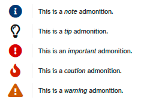
2. In the HTML version: \
   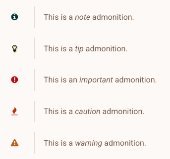
3. In the EPUB version: \
   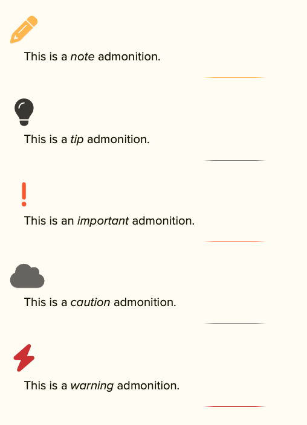
4. In the single file Markdown version:
   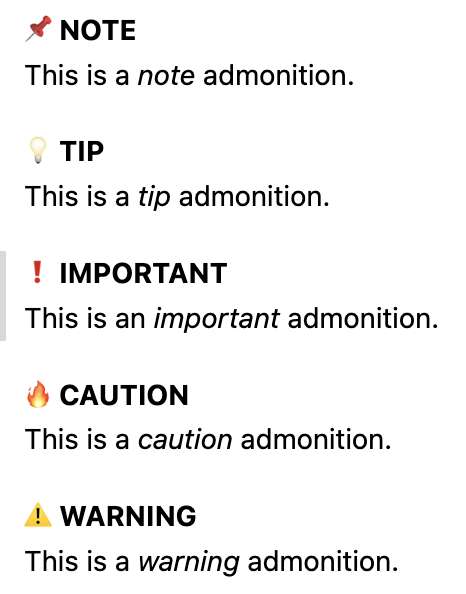

Sadly they do not (currently?) render nicely in the DOCX or ODT versions:

1. In the DOCX version: \
   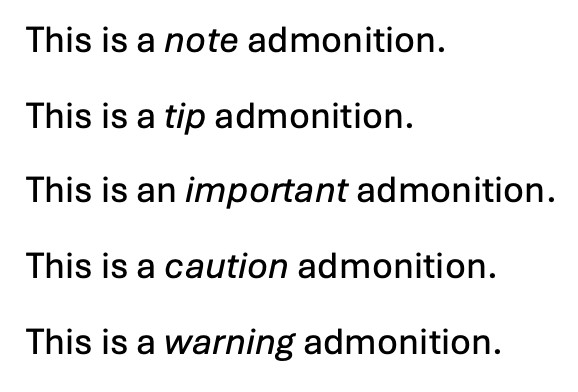
2. In the ODT version: \
   

#### Sidebars

Sidebars are used for information that relates to the current content but doesn't quite fit in the content's flow.

To achieve a sidebar, we create a quotation block and then annotate it with a comment:

```md
<!-- style:sidebar -->
> **Title of the sidebar** \
> This is the content of the sidebar.
> With just a single line break, the rendered line is continued.
>
> Multiple line breaks however will show up as a new paragraph.
```

The first line of the quotation block must be bold and end in a single backslash (as a Markdown linebreak).
It will then be interpreted as the title of the sidebar.

This will be rendered as follows:

1. In the PDF version: \
   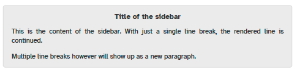
2. In the HTML version: \
   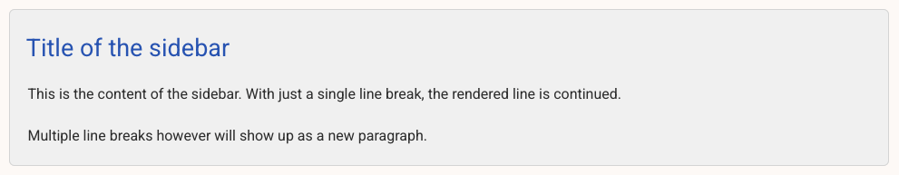
3. In the EPUB version: \
   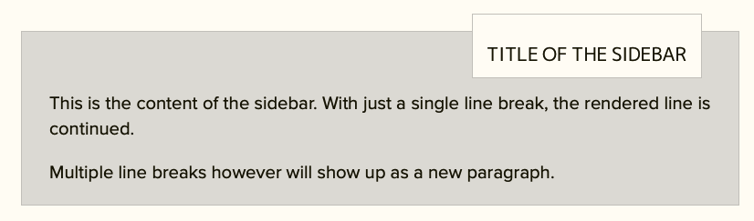

Sadly they do not (currently?) render nicely in the single file Markdown, DOCX, or ODT versions:

1. In the single file Markdown version:
   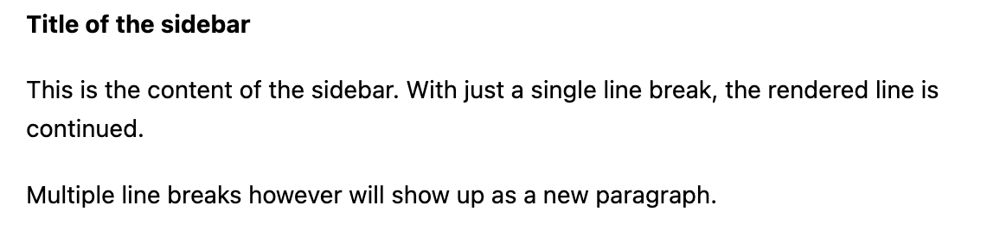
2. In the DOCX version:
   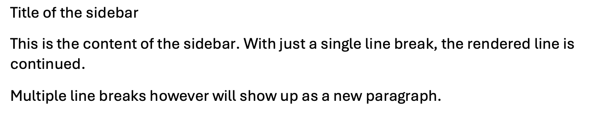
3. In the ODT version:
   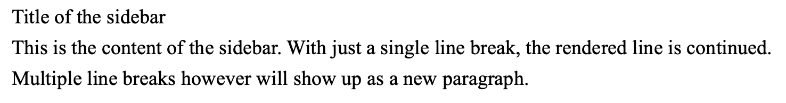
