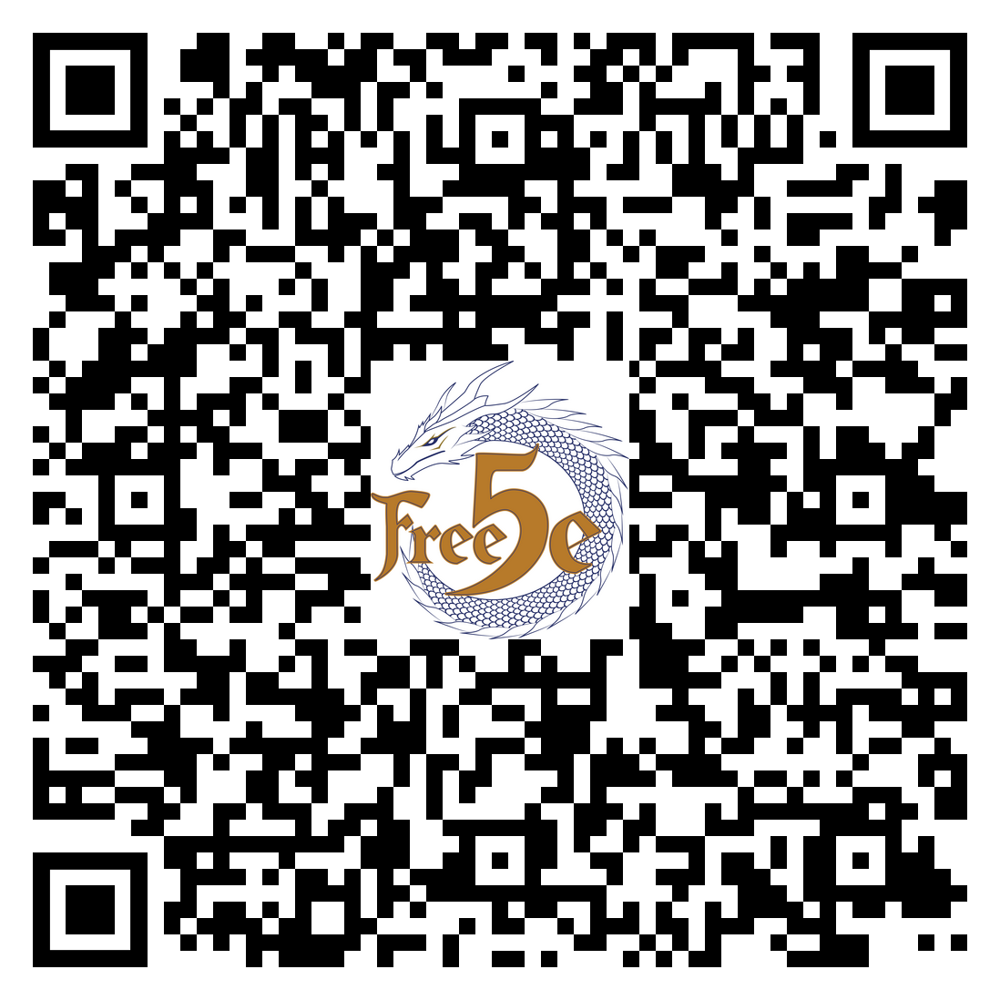

**Something writhes in the shadows.**
**The story is yours.**

A dragonborn steps into an ancient ruin, her gnarled staff flickering with energy.
Beside her, an elven ranger draws an arrow, scanning the darkness.
Across the table, a player cracks a grin as the dice hit the table, and the monster recoils from a biting insult delivered with arcane force.

You stand at the threshold of adventure, not someone else's, but one shaped by your voice, your choices, and your vision of who belongs in the tale.

**This is Free5e.**

More than just rules, this Character's Codex is your gateway to collaborative adventure.
Build heroes shaped by imagination and lived experience.
Face the unknown with tools forged for equity, creativity, and community.

Craft heroes who reflect complex identities, layered motivations, and abilities that go beyond the default, and tell stories that matter.

**Free to use.**
**Free to share.**
**Free to be yourself.**

**Free5e: Where your story belongs.**

> **This is just the beginning.**
> \
> The Free5e Character's Codex is one of three core volumes.
> Ready to lead adventures of your own?
> The Conductor's Companion gives you everything you need to build and run stories for others.
> Need foes to challenge your heroes?
> Monstrous Manuscript unleashes a host of ready-to-use adversaries.
> Find them all at [Free5e.com](https://free5e.com) or scan the code below.
> \
> 
